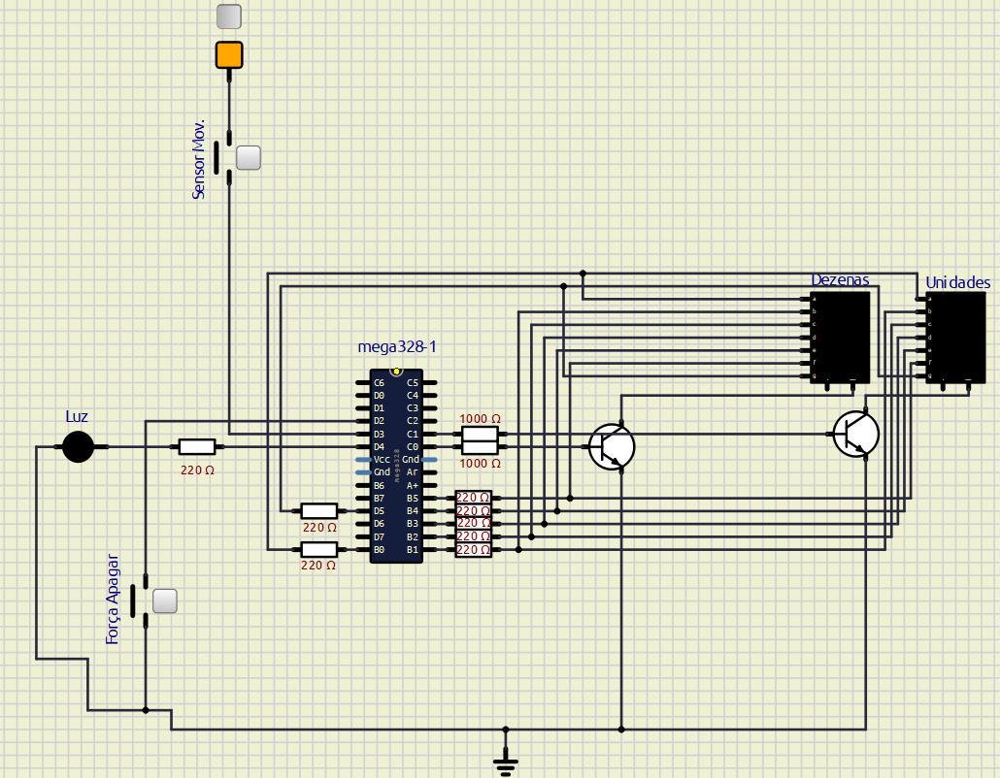

# Materiais Utilizados e Hardware

## Materiais utilizados:
Para a construção do circuito físico, utilizamos os seguintes materiais:
* 2 Displays de 7 segmentos cátodo comum
* 1 Sensor de movimento PIR HC -SR501
* 1 LED 5 mm azul
* 2 Protoboards 830 pontos
* 3 Kits jumpers macho-macho e 3 kits jumpers macho-fêmea
* 2 Transistores BC547
* 1 botão
* 8 resistores de 220 ohms
* 2 resistores de 1k ohm

## Diagrama do circuito (simulIDE):
Em seguida, temos em anexo, o diagrama no simulIDE, onde priorizamos a clareza visual, mantendo apenas um terra na parte inferior e a boa organização dos fios. 

